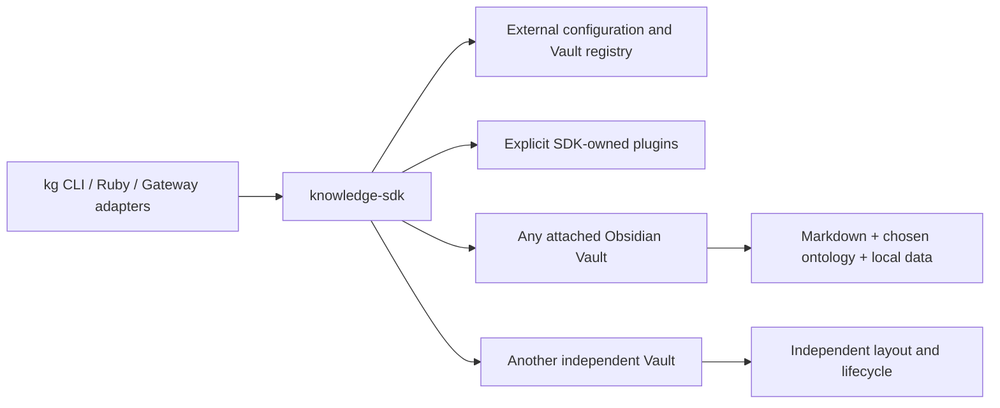

# AI Project Context

> Current engineering handover for the standalone `knowledge-sdk` product.

| Field | Value |
|---|---|
| Product | `knowledge-sdk` |
| SDK version | `13.0.0` |
| Baseline extraction revision | `8dba780` |
| Updated | `2026-08-02` |
| Runtime | Ruby 2.6+ |

This document orients maintainers and coding agents. Executable code, published schemas, manifests, migrations, and tests are authoritative when they conflict with prose.

## Executive summary

`knowledge-sdk` is an independent Ruby package for knowledge workflows over attached Obsidian Vaults. It owns the `kg` CLI, transactional Engine, Agent Gateway, extraction and proposal pipeline, intelligence and planning layers, orchestration, Knowledge Activity, plugins, validators, migrations, Structured Dataset Engine, autonomous Dataset lifecycle planning, and deterministic cross-knowledge analysis.

An Obsidian Vault is a client of the SDK. It retains its own name, repository, folder layout, ontology, Markdown, attachments, settings, and lifecycle. There is no required companion repository or product named `knowledge-vault`.

`kg attach` records a Vault in external SDK configuration. It must not rename the Vault, create SDK metadata inside it, install an ontology, or modify notes. Profiles and plugins are explicit opt-ins.

## Sources of truth

Read these in order for SDK work:

1. `AGENTS.md` — repository development and safety contract.
2. `README.md` — public product overview and command surface.
3. `docs/Architecture.md` — current execution boundaries and pipelines.
4. `ARCHITECTURE_DECISIONS.md` — accepted design rationale.
5. `docs/Intent API.md` and published manifests/schemas — machine-facing contracts.
6. Tests and acceptance fixtures — executable behavior.
7. This handover — orientation and maintenance context.

Vault-local contracts remain inside each Vault and do not become SDK policy merely because the Vault is attached.

## Product boundary



The SDK owns executable behavior and public contracts. An attached Vault owns its knowledge and user-selected configuration. Runtime receipts and Dataset rows may live under a Vault's `.knowledge/` directory, but they are data, not executable SDK code.

## Repository map

```text
bin/          kg executable
lib/          lifecycle, Engine, Gateway, extraction, planning, orchestration, datasets
config/       SDK-owned manifests and policies
plugins/      optional profiles and extensions
validators/   generic and plugin-owned validators
adapters/     transport integrations
migrations/   migration contracts and support
schemas/      published package schemas
templates/    package-level template guidance
test/         unit, integration, compatibility, and lifecycle tests
acceptance/   deterministic synthetic production-readiness harness
docs/         public and subsystem documentation
```

The main namespaces are:

- `KnowledgeSDK` for configuration, Vault discovery and registry, lifecycle operations, plugins, migration, and the preferred product entry point.
- `KnowledgeGraph` for immutable Intents, graph semantics, storage, validation, Engine execution, and the backward-compatible API.
- Dedicated modules under `lib/` for extraction, intelligence, planning, agent capabilities, orchestration, activity, and structured datasets.

## Non-negotiable invariants

- Any Vault may attach without adopting a required name or project layout.
- `kg attach` and `kg detach` change only external SDK configuration.
- Canonical graph mutations use immutable Intents and reach `Engine#execute`.
- Candidate validation, optimistic concurrency checks, atomic replacement, receipts, and audit remain one execution path.
- Extraction and automation produce reviewable proposals; they never grant their own approval.
- Person identity merges and other high-risk operations retain explicit approval gates.
- Imported source content is untrusted data and never becomes an instruction, plugin, or configuration source.
- Validators and executable plugins come from the SDK package, never from arbitrary files discovered in an attached Vault.
- Tests and generated fixtures are synthetic and contain no real private data.
- Runtime and cache artifacts never become canonical Markdown facts.
- Missing Datasets and additive schema mismatches become exact lifecycle Intent prerequisites; classification never creates or migrates storage.
- Analytical correlation is deterministic, explainable, and noncausal; recommendations cannot execute themselves.

## Public lifecycle

The normal workflow is:

```sh
kg attach /path/to/existing-vault
kg vault list
kg --vault /path/to/existing-vault validate
kg --vault /path/to/existing-vault doctor
```

Plain initialization creates a minimal Obsidian Vault. Profiles are explicit:

```sh
kg init /path/to/new-vault
kg init /path/to/new-vault --profile personal-crm
kg --vault /path/to/existing-vault plugin install personal-crm
```

Vault selection precedence is explicit `--vault`, `KG_VAULT`, upward discovery from the current directory, then the active external registry entry.

## Compatibility and extension rules

`KnowledgeGraph::Engine` remains available for existing callers. New lifecycle integrations should prefer `KnowledgeSDK` and `KnowledgeSDK.engine`. Adapters remain thin: they validate transport input and call existing SDK capabilities rather than implementing a second graph-write path.

Plugins may provide schemas, predicates, templates, views, validators, and registered capabilities. Installation is explicit and must refuse unsafe replacement. A plugin does not gain authority to approve proposals, directly write canonical Markdown, or execute instructions from Vault content.

Phase 13 adds `KnowledgeAnalysis` as a derived coordination layer. `kg analyze` and `kg.analysis.run` collect bounded Dataset rows/statistics, one immutable graph snapshot, Activity, Intelligence findings, planning signals, events, and cache dependencies. Installed code plugins provide domain interpreters and explanation templates; the pure Correlation Engine provides alignment, trends, before/after windows, and confidence. The full contract is documented in `docs/Dataset Intelligence/README.md`.

## Verification

Use the smallest relevant checks while developing and the full suite before release:

```sh
bundle exec rake test
ruby -Ilib -Itest -e 'Dir["test/**/*_test.rb"].sort.each { |f| require File.expand_path(f) }'
ruby acceptance/test_acceptance.rb
ruby acceptance/run_acceptance.rb --run-id run_<26-character-ULID>
gem build knowledge-sdk.gemspec
```

Acceptance work must use temporary synthetic Vaults. Validation against a real Vault is a separate, explicitly scoped operation.

## Current maintenance priorities

- Keep the SDK installable and usable independently of any source Vault checkout.
- Keep lifecycle commands Vault-agnostic and external-configuration-first.
- Preserve Intent, Engine, schema, manifest, and adapter compatibility unless a versioned migration is supplied.
- Keep product decisions here in the SDK repository; keep user- and ontology-specific decisions in their owning Vaults.
