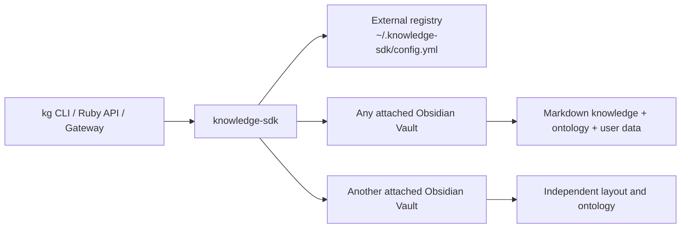

# knowledge-sdk

`knowledge-sdk` is a standalone Ruby product for Obsidian knowledge workflows. It contains the CLI, transactional Engine, Agent Gateway, Knowledge Extraction Pipeline, intelligence and planning layers, event orchestration, Knowledge Activity, plugins, validators, and Structured Dataset Engine.

An Obsidian Vault is a client of the SDK. It keeps its own name, repository, folder layout, ontology, notes, attachments, and Obsidian settings. The SDK never requires a project named `knowledge-vault`, never creates `.vault.yml`, and `kg attach` does not modify the Vault.



## Requirements and installation

Ruby 2.6 or newer is supported. SQLite-backed dataset commands require the `sqlite3` gem.

Install the latest version from the public repository:

```sh
curl -fsSL https://raw.githubusercontent.com/rozdol/knowledge-sdk/main/install.sh | sh
```

The installer requires Git, Ruby, and RubyGems. It builds the gem from source and uses a
user-local RubyGems directory automatically when the active system gem directory is not writable.
To install a particular tag, branch, or commit, pass `--ref`, for example:

```sh
curl -fsSL https://raw.githubusercontent.com/rozdol/knowledge-sdk/main/install.sh | sh -s -- --ref v15.0.0
```

For source development:

```sh
bundle install
bundle exec rake test
gem build knowledge-sdk.gemspec
gem install ./knowledge-sdk-15.0.0.gem
```

During source development, use `ruby bin/kg`; after installation, use `kg`.

## Attach an existing Vault

```sh
kg attach ~/vaults/Personal
kg attach ~/research-notes --name Research
kg vault list
kg vault use Research
kg doctor
```

Attachment records the absolute path and optional profile in the SDK's external configuration. It writes nothing into the Vault. Vault selection order is:

1. `--vault PATH`;
2. `KG_VAULT`;
3. upward discovery from the current directory using `.obsidian` or a registered root;
4. the active attached Vault.

If no Vault resolves, the CLI returns a clear error. Every knowledge command accepts `--vault PATH`; lifecycle commands do not assume a fixed path.

## Create a plain Vault or opt into a profile

```sh
kg init ~/vaults/Notes
kg init ~/vaults/CRM --profile personal-crm
```

Plain `kg init` creates only the target and its normal `.obsidian` directory, then attaches it. The bundled `personal-crm` profile is optional and installs its schemas, predicate registry, templates, and views only when explicitly requested. `kg --vault PATH plugin install personal-crm` is the equivalent operation for an existing Vault.

## Core commands

- SDK lifecycle: `kg init`, `attach`, `detach`, `upgrade`, `migrate`, `version`, `id`, `vault`, and `plugin`.
- Graph: `execute`, `validate`, `doctor`, `graph`, `stats`, `search`, and `replay`.
- Review workflow: `observe`, `extract`, `proposal`, `chat`, and `activity`.
- Analysis and decisions: `analyze`, `intelligence`, `goal`, and `plan`.
- Platform: `gateway`, `events`, `workflow`, `scheduler`, `notifications`, and `cache`.
- Structured rows: `dataset create|list|describe|insert|update|delete|query|export|import|stats|explain|migrate`.

Global options are `--vault`, `--config`, `--dataset-db`, `--run-id`, and `--actor-id`. Environment overrides are `KG_VAULT`, `KG_CONFIG`, `KG_DATASET_DB`, `KG_RUN_ID`, and `KG_ACTOR_ID`.

## Dataset intelligence

Conversational structured observations no longer stop when a Dataset is missing or needs additive columns. The review proposal includes an approval-gated `CreateDataset` or `UpgradeDatasetSchema` prerequisite, then retries the original Dataset row Intent after that prerequisite succeeds.

Version 15 adds an immutable, versioned Dataset Template Registry. Trusted plugins contribute schemas, parsers, validation, units, analyzers, visualizations, privacy defaults, recommendation rules, and adapter declarations. PDF/OCR text, CSV, Excel renditions, email, transcript, and ordinary text can select a template without asking the user to choose a Dataset or schema. A recognized source produces one review proposal containing the lifecycle prerequisite and all parsed row Intents:

```text
incoming evidence -> template selection -> exact approval
  -> Dataset provisioning -> row import -> DatasetChanged -> Knowledge Activity
```

The bundled catalogue covers Health, Finance, Trading, CRM, and Generic observations. Blood tests use normalized analyte/value rows rather than one column per biomarker, preserve the supplied reference interval and flag, and retain row-level source URI, filename, page, span, Evidence ID, observation, proposal, approval, and Intent provenance. `kg chat --explain` reports the selected template, confidence, reason, planned collection, and planned observation count without exposing schema or SQL details. See [Dataset Template Guide](docs/Dataset%20Template%20Guide.md).

`kg analyze` combines graph evidence, structured rows and statistics, Knowledge Activity, Knowledge Intelligence findings, planning signals, events, and derived cache state through deterministic installed analysis plugins:

```sh
kg analyze "Why has my LDL increased during the last six months?"
kg analyze "What subscriptions increased my monthly expenses?" --json
```

Answers identify the datasets, graph facts, time windows, confidence, and limitations used. Correlations are labeled as possible contributing factors and never presented as causality. Recommendations remain non-executable unless explicitly persisted as a review-only proposal with `--propose-recommendations`.

Medication schedules use the generic `KnowledgeSDK::Schedule` value object and immutable
`medschedule_<ULID>` versions. Multiple rows for the same medication are valid; recurrence and
effective intervals are structured rather than inferred from prose during analysis. Legacy
`schedule`/`effective_on` datasets are migrated through an exact-approved, copy-and-verify
`UpgradeDatasetSchema` prerequisite. See [Health Plugin](docs/Health%20Plugin/README.md).

## Ruby API

```ruby
require "knowledge_sdk"
require "knowledge_graph"

vault = KnowledgeSDK::VaultLocator.new.resolve.path
engine = KnowledgeSDK.engine(
  vault: vault,
  run_id: "run_<26-character-ULID>",
  actor_id: "local-automation"
)

result = engine.execute(
  KnowledgeGraph::AddRelationship.new(
    source: "person_<ULID>",
    predicate: "knows",
    target: "person_<ULID>"
  )
)
```

`KnowledgeGraph::Engine` remains available as a backward-compatible API. All canonical writes still pass through immutable Intents, candidate-Vault validation, optimistic concurrency checks, atomic replacement, audit, and idempotency receipts.

## Vault data boundary

The SDK owns executable code, configuration, tests, documentation, migrations, validators, adapters, and plugins. A Vault owns its Markdown, ontology, templates/views chosen by the user, attachments, Obsidian settings, and local `.knowledge/` data. Operational state lives under `.knowledge/runtime/`; structured rows live at `.knowledge/datasets.sqlite3`. Neither is executable business logic or an alternate Markdown fact store.

## Verification

```sh
ruby -Ilib -Itest -e 'Dir["test/**/*_test.rb"].sort.each { |f| require File.expand_path(f) }'
ruby acceptance/test_acceptance.rb
ruby acceptance/run_acceptance.rb --run-id run_<26-character-ULID>
kg --vault /path/to/vault validate
kg --vault /path/to/vault doctor
```

See [Installation](INSTALL.md), [AI Project Context](AI_PROJECT_CONTEXT.md), [Architecture Decisions](ARCHITECTURE_DECISIONS.md), [Architecture](docs/Architecture.md), [Dataset Intelligence](docs/Dataset%20Intelligence/README.md), [Configuration Guide](docs/Configuration%20Guide.md), [Migration Guide](docs/Migration%20Guide.md), [Plugin Guide](docs/Plugin%20Guide.md), [Developer Guide](docs/Developer%20Guide.md), and [Intent API](docs/Intent%20API.md). Automated contributors must also follow [AGENTS.md](AGENTS.md).
