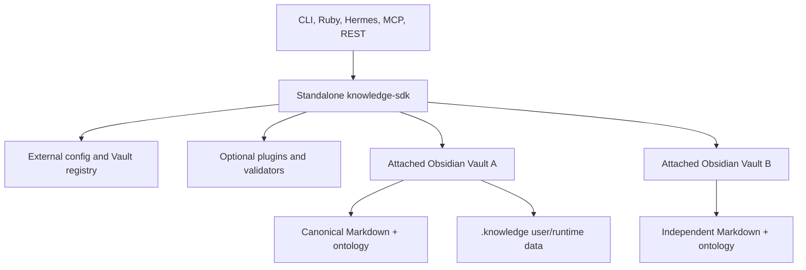
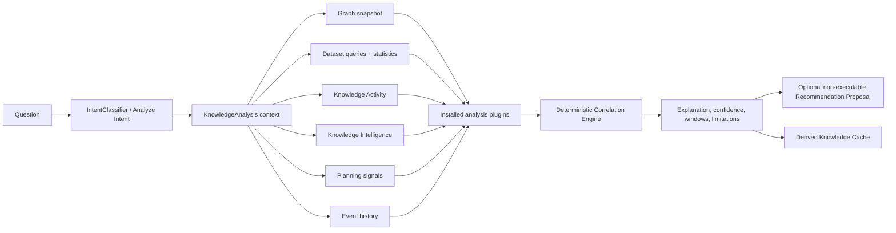

# Architecture Guide

## Product and Vault boundary

`knowledge-sdk` is the only software product. There is no companion product or required repository named `knowledge-vault`. Any Obsidian Vault may attach as an independent client and retains its own name, layout, ontology, repository, and lifecycle.



`kg attach` updates only the external registry. It never creates Vault metadata. Canonical facts remain in Markdown frontmatter. The Engine is a storage boundary, not a new canonical database: runtime receipts and the audit log contain execution metadata and can be rebuilt or removed without changing graph facts. SQLite is canonical only for structured Dataset rows whose Dataset identity remains a Markdown note.

## One execution pipeline

Every public write reaches `Engine#execute` and follows one path:

```text
immutable Intent
  -> before_execute hook
  -> durable receipt lookup
  -> dispatcher / capability handler
  -> staged filesystem transaction
  -> candidate-vault validate_vault.rb
  -> before_commit hook
  -> optimistic concurrency check
  -> atomic file replacement + receipt commit
  -> after_commit hook
  -> replayable JSONL audit event
```

The Agent Platform is the public authorization and capability-dispatch boundary for Hermes, MCP, REST-style clients, and new agent integrations. Existing direct Engine calls remain an internal/local SDK compatibility surface. Proposal submission still reaches `Engine#execute`, so Agent Platform policy augments rather than replaces Engine approval gates.

## Planning and decision pipeline

Phase 8 is a read-only decision layer above the graph snapshot and Intelligence features. Planning and decision are deliberately separate:

```text
immutable Goal + composable Constraints
  -> Candidate Plan Generator (one or more deterministic planners)
  -> Scenario Evaluator (simulation, features, hard-constraint checks)
  -> Decision Engine (shared policy, Pareto frontier, stable ranking)
  -> decision-approved Plan + alternatives + machine-readable trace
  -> optional review-only Intent Proposal
  -> existing explicit human approval
  -> existing Engine
```

“Decision-approved” means only that a plan ranked first after hard constraints. It is not human approval and gives no execution authority. The planning module has no Engine, dispatcher, repository writer, or autonomous-agent dependency. Given the same graph snapshot, goal, constraints, policy, and `as_of` date, its canonical result is identical.

## Intent classification and Dataset routing

`kg chat` and `kg observe` use one SDK-owned hierarchical `KnowledgeSDK::IntentClassifier`. Phase 1 detects one semantic domain:

```text
health | finance | crm | trading | knowledge | generic
```

Phase 2 evaluates every registered non-fallback classifier plugin for the winning domain and selects the result with the highest confidence. A plugin registration declares its domain and route; its matcher returns `intent`, `confidence`, and `explanation`, plus optional slots. If no winning-domain plugin matches, generic analysis, planning, proposal, Dataset-table, and search plugins are evaluated. The generic graph classifier is marked as a separate fallback tier and runs only when every applicable specialized and generic plugin returned no result.

```text
semantic domain detection
  -> winning-domain plugins (highest confidence)
  -> generic analysis / planning / proposal / Dataset-table / search plugins
  -> graph.observe classifier of last resort
```

Sentence type is not a domain or routing decision. In particular, a declarative sentence cannot outrank a health Dataset plugin merely because it lacks a question mark. Structured observations are classified before graph extraction. Medication schedules, measurements, laboratory results, body measurements, and financial rows use `kg.datasets.propose`, which creates an immutable proposal through the existing Proposal Store and validator. Ambiguous structured tables remain on the Dataset route for schema clarification and never fall through to graph extraction.

```text
structured message -> Dataset classification -> named immutable Dataset Intent
  -> existing review-only Proposal -> exact human approval
  -> existing Engine receipt/audit lifecycle -> registered Dataset handler
  -> Structured Dataset Engine SQLite transaction -> DatasetChanged
  -> existing Knowledge Activity projection
```

Named Dataset Intents contain row values and provenance but no graph attributes. Their Engine result identifies the canonical Dataset registry note; raw row values remain exclusively in SQLite. An optional graph statement such as “Alex has a medication schedule” is a separate semantic proposal and never contains the schedule rows.

## Autonomous Dataset lifecycle

Dataset absence and additive schema drift are proposal prerequisites, not terminal blockers:

```text
classified Dataset observation
  -> AutonomousRegistry inspects graph registry + SQLite schema history
  -> missing: CreateDatasetProposal / immutable CreateDataset
  -> mismatch: DatasetSchemaUpgradeProposal / immutable UpgradeDatasetSchema
  -> original Dataset row Intent depends on lifecycle Intent
  -> exact human approval of immutable Intent IDs
  -> dependency-ordered Proposal Submitter
  -> existing Engine validation/audit/receipt boundary
  -> lifecycle handler creates or additively migrates Dataset
  -> original row Intent retries through Engine
  -> DatasetChanged + Knowledge Activity
```

Schema upgrade Intents bind the observed schema version and complete additive definition. Execution rechecks the version before mutation. New columns are optional; destructive removal, reorder, rename, retype, and constraint changes remain rejected. The planner performs no write and never treats attached-Vault content as executable schema policy.

## Cross-knowledge analysis pipeline

`kg analyze` is a derived read pipeline that composes stable subsystems. It is not a second Intelligence, Planning, Activity, or Dataset implementation.



The Correlation Engine provides stable time alignment, windowing, cross-Dataset pairing, trend detection, event comparison, Pearson association, and confidence estimation. It contains no model call or hidden reasoning. Every factor says `causal: false`. Recommendation candidates become review-only Planning candidate objects and use the existing Decision Engine policy for stable ranking; they contain zero generated Intents and remain non-executable until a later concrete Intent proposal is explicitly approved.

## Agent execution pipeline

```text
policy-filtered manifest discovery
  -> opaque invocation token
  -> immutable AgentRequest
  -> manifest input validation
  -> centralized policy and exact approval check
  -> private handler binding
  -> existing Graph / Extraction / Intelligence API
  -> manifest output validation and leak guard
  -> structured AgentResponse + sanitized telemetry
```

Agents cannot dispatch arbitrary capability names. Transport strings are selectors only: an adapter resolves them against current policy-filtered discovery and invokes the Gateway with the manifest-issued opaque token.

## Event-driven orchestration pipeline

Phase 9 coordinates the stable components without moving planning, decision making, approval, or execution into the Orchestrator:

```text
immutable Event -> versioned Event Bus -> declarative Trigger
  -> deterministic Workflow DAG -> durable Job
  -> policy-filtered Agent Gateway capability
  -> derived Knowledge Cache artifact / notification / review-only proposal
  -> explicit human approval -> existing Engine
```

Workflow definitions cannot contain `kg.proposals.submit`, and runtime invocation rejects every graph-write or existing-approval capability. A workflow may produce a review-only proposal, but the Orchestrator cannot approve or submit it.

The Knowledge Cache is not a fact cache and not a graph cache. It stores only derived, reproducible outputs such as analyzer results, plans, reports, briefings, digests, recommendations, and workflow outputs. Every artifact records its producing capability version, immutable graph snapshot digest, originating event IDs, invalidating event types, and optional entity scope. A new event marks only affected artifacts stale; a snapshot mismatch prevents reuse even before stale marking.

## Knowledge Activity projection

Phase 10A presents successful Engine changes as human-oriented activities. It joins existing audit receipts, Event Bus history, proposal/approval/submission receipts, and the current immutable graph snapshot at read time. Activity IDs are derived from audit IDs, so the projection has no store of its own.

Undo and restore perform no graph write. They derive lossless existing Intents from audit/replay history, preserve exact audit evidence and confidence fields in a fresh immutable proposal, and stop at `awaiting_approval`. Only the existing approval and Proposal Submitter path may later reach the Engine.

## Modules

- `knowledge_sdk/` owns external configuration, generic Vault attachment/discovery, lifecycle commands, optional profile discovery, and extraction migration.
- `intents.rb` defines immutable commands and their serialization contract.
- `executor/` owns dispatch, hooks, locks, optimistic concurrency, commit, and rollback.
- `storage/` parses canonical notes, loads schema v1.0, generates deterministic flat YAML, resolves paths, and preserves bodies.
- `validation/` builds an isolated candidate vault and invokes the existing validator before live changes.
- `graph/` validates predicates, endpoint types, symmetric ordering, retractions, replacements, and duplicate signatures.
- `identity/` indexes exact identity signals, follows merge redirects, and performs atomic merge/split operations.
- `audit/` stores local JSONL events and transactionally committed idempotency receipts.
- `cli/` exposes the same SDK capabilities without a second execution path.
- `knowledge_planning/` owns immutable goals and plans, constraint evaluation, graph search, candidate planners, scenario simulation, shared decision policy, explanations, traces, and review-proposal adaptation. It never mutates the graph.
- `agent_platform/` owns manifests, Registry, Gateway, policy, sessions, adapters, jobs, telemetry, plugins, and generated contract artifacts. It does not parse Markdown or YAML.
- `knowledge_orchestration/` owns immutable events, the internal bus and dead-letter queue, trigger and workflow DSL, dependency graph, derived-artifact Knowledge Cache, durable jobs, cron scheduler, notifications, replay, and sanitized timelines. It invokes existing components only through Agent Gateway capabilities.
- `knowledge_activity/` owns the read-time Activity projection, human summaries, temporal filtering/search/diff, privacy redaction, explainability joins, and review-only undo/restore proposal adaptation. It has no canonical writer or Activity store.
- `knowledge_sdk/intent_classifier.rb` owns semantic-domain detection, domain-scoped plugin confidence arbitration, the explicit generic fallback tier, and the immutable classification contract used by chat and observation.
- `structured_dataset/routing.rb` owns Dataset classifiers, named Dataset Intent proposal construction, and the handlers registered on the existing Engine. It never invokes graph extraction for row data.
- `structured_dataset/evolution.rb` owns read-only autonomous lifecycle planning and emits `CreateDataset` or `UpgradeDatasetSchema` prerequisites. Only the approval-gated Dataset handler executes them.
- `knowledge_analysis/` owns the cross-subsystem analysis context, deterministic Correlation Engine, analysis plugin registry, response aggregation, derived caching, recommendation envelopes, and `kg analyze` CLI. It never writes graph facts or Dataset rows.

## Transaction guarantees

Files are staged in memory. Before commit, the Engine re-reads every affected live file and compares its SHA-256 fingerprint with the inspected snapshot. A mismatch aborts without restoring stale content. Commit uses same-directory temporary files and rename; any mid-commit exception restores all pre-write snapshots. A vault-specific process lock serializes Engine writers.

The candidate validator receives copies of all validation-relevant Markdown and the staged overlay. Validators are SDK/plugin resources, never executable files copied from an attached Vault. Invalid changes never touch the live Vault.

## YAML and bodies

The writer accepts only scalars and flat scalar lists, emits canonical property order, quotes strings (therefore every wiki link), and rejects nested YAML. Update operations preserve unknown keys and all body bytes. Body-writing capabilities operate only in named `AGENT-MANAGED` sections; merge and rename may perform verified wiki-link target rewrites required for graph consistency.

## Relationships

One Relationship note is one canonical edge. Symmetric predicates sort endpoints by immutable ID. Inverses are registry/query semantics, so the Engine does not create a mirrored second edge. `RemoveRelationship` retracts rather than deletes. `ReplaceRelationship` retracts the original and asserts its replacement in one transaction.

## Identity and merge

Exact IDs and merged redirects resolve first, followed by strong normalized identifiers. Names and aliases generate candidates but never authorize a merge. Person merge/split requires `human_approved: true`. Merge preserves the losing body in its redirect stub, rewrites verified links and sibling IDs, reorders symmetric roles, and retracts duplicate edge signatures. Conflicting non-policy scalar facts abort the merge.

## Idempotency and audit

An Intent fingerprint is SHA-256 over canonical JSON serialization. A successful command stages `.knowledge/runtime/receipts/<fingerprint>.json` in the same transaction as graph changes. Re-execution validates the Vault and returns the stored result with `replayed: true`.

Each attempt appends a local JSONL audit event containing timestamp, Intent payload, affected IDs, result, duration, rollback flag, replay flag, run ID, and actor ID. Runtime data lives under `.knowledge/runtime/`, is local and Git-ignored by the bundled migration guidance, and is operational history rather than a source of canonical facts. Dataset rows live separately at `.knowledge/datasets.sqlite3`.
