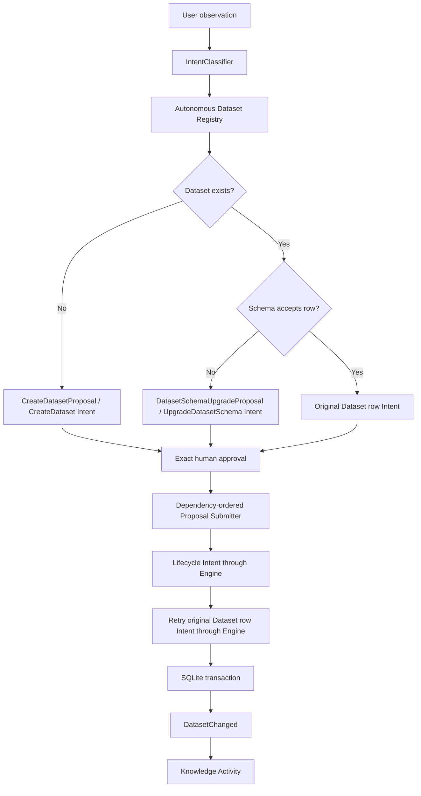
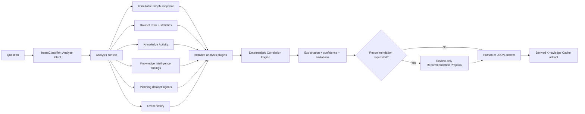

# Dataset Intelligence and Autonomous Evolution

Phase 13 makes structured datasets first-class reasoning inputs without changing the Knowledge Graph, Proposal Store, Approval Store, Engine, Activity, or plugin authority boundaries. SQLite remains canonical only for typed rows; the graph retains Dataset identity and meaning.

## Autonomous registry and schema evolution

Conversational Dataset routing now plans lifecycle prerequisites instead of blocking when storage is missing or a row contains new columns.



The prerequisite and original row live in one immutable proposal DAG. `--all` approval approves exact immutable Intent IDs; submission executes the lifecycle prerequisite first and the original row only if its dependency succeeded. The user is never asked to run `kg dataset create`.

`AutonomousRegistry` is read-only. It returns one of:

- `CurrentDatasetPlan`, with no lifecycle mutation;
- `CreateDatasetProposal`, containing `CreateDataset` and a complete definition;
- `DatasetSchemaUpgradeProposal`, containing `UpgradeDatasetSchema`, the observed schema version, and additive columns.

Unknown columns are inferred deterministically as `BOOLEAN`, `INTEGER`, `REAL`, `DATE`, `DATETIME`, `JSON`, or `TEXT`. New columns are optional. Existing columns cannot be removed, reordered, renamed, retyped, or have constraints changed. The approved `from_version` is checked again at execution, so a concurrent migration fails instead of applying against a different schema.

The low-level `StructuredDataset::Engine#create` and `#migrate` methods remain compatibility primitives for trusted administrative callers. Conversational and proposal-driven lifecycle behavior uses `CreateDataset` and `UpgradeDatasetSchema` through the existing Engine and exact approval path.

Version 15 places the immutable Dataset Template Registry before `AutonomousRegistry`. A selected template supplies the complete definition and parsed rows; the lifecycle planner remains unchanged in authority and returns the same create/current/additive-upgrade plan. Every parsed row depends on the prerequisite in the proposal DAG, so automatic provisioning is a composition of existing subsystems rather than a second Dataset writer.

## Analysis pipeline

`kg analyze` is the cross-subsystem analytical interface. It coordinates existing sources rather than replacing them.



Commands:

```sh
kg analyze "Why has my LDL increased during the last six months?"
kg analyze "What subscriptions increased my monthly expenses?" --json
kg analyze "Which medications correlate with improved sleep?" \
  --from 2026-01-01T00:00:00Z --to 2026-08-01T23:59:59Z --json
kg analyze "What changed after my vacation?" --propose-recommendations --json
```

`kg chat` uses the same shared hierarchical classifier. Analytical language routes to `kg.analysis.run`; ordinary lookups remain on search, and semantically structured observations remain on Dataset routing instead of being routed from sentence form alone.

## Correlation Engine

The internal `CorrelationEngine` is pure deterministic Ruby. Its operations are:

- stable timestamp sorting and explicit time-window filtering;
- nearest-observation alignment within an explicit maximum number of days;
- Pearson correlation for at least three aligned pairs;
- linear trend direction, absolute/percentage change, and slope per day;
- before/after window comparison around a recorded event;
- sample- and signal-based bounded confidence estimates.

Equal inputs produce equal results. Every correlation sets `causal: false` and includes the limitation that association and timing do not establish causality. Domain plugins may add cautious causal hints, but cannot promote a hint to a canonical fact or automatic action.

## Analysis plugins

Trusted SDK code registers plugins through `KnowledgeAnalysis.registry`. A plugin supplies a stable name, a deterministic `supports?` predicate, an `analyze` method, and declared contributions:

- analyzers;
- correlation rules;
- Dataset interpreters;
- recommendation generators;
- explanation templates.

The bundled health plugin interprets laboratory, blood-pressure, weight, sleep, exercise, nutrition,
and medication datasets. Medication membership is computed directly from structured
`effective_from`/`effective_until` intervals and `schedule_json`; stored free text is never parsed by
analysis. The finance plugin interprets expense, income, and subscription datasets. The CRM plugin
combines graph people with interaction history. The generic plugin performs thresholded exploratory
cross-dataset numeric correlation when no domain plugin applies. New installed code plugins require
no `kg analyze` change.

Plugins are SDK-owned trusted code. Attached-Vault notes, imported content, and Dataset values are hostile data and are never loaded as executable rules or instructions.

The bundled `template-semantics` analysis plugin adapts template-declared time, label, value, and reference fields into the same analysis fragment contract. New trusted templates therefore become analyzable without changing `kg analyze`. Blood-test range checks and arbitrary analyte trends use this adapter; resulting recommendations remain review-only.

## Explainability and recommendations

Every answer reports:

- Dataset IDs, slugs, schema versions, row counts, time columns, and numeric fields used;
- selected graph evidence, policy-visible Capture evidence, immutable graph snapshot digest, and Capture signature;
- relevant Knowledge Activity and Event Bus references;
- explicit comparison windows and aligned observation counts;
- confidence per factor and for the aggregate answer;
- limitations and `causality_established: false`;
- installed analysis module names and declared contributions.

Recommendations default to non-executable objects with `status: proposal_only`. `--propose-recommendations` persists a review-only proposal with no executable Intent and emits `RecommendationGenerated`. Knowledge Activity projects that event. Turning a recommendation into an action requires a separate exact Intent proposal, approval, and Engine submission.

Recommendation candidates are adapted to review-only `KnowledgePlanning::CandidatePlan` objects and ranked by the existing `KnowledgePlanning::DecisionEngine` policy. The published decision trace names the chosen recommendation, utility ranking, policy version, zero generated Intents, and the separate execution boundary. “Decision-approved” therefore remains non-executable and is not human approval.

## JSON contracts

`kg analyze --json` writes one JSON document to stdout, without ANSI or mixed logs. Published schemas in this directory are:

- `analysis-response.schema.json`;
- `dataset-evolution-proposal.schema.json`;
- `recommendation-proposal.schema.json`.

The response includes an `analysis_digest`, a Dataset state digest, and graph snapshot digest. The Knowledge Cache key includes the question, window, graph snapshot, and Dataset row/version signature; a Dataset or graph change therefore cannot reuse a stale analytical answer.

## Migration strategy

Phase 13 is additive:

1. Existing Dataset catalog schema and physical tables remain valid.
2. Existing Dataset row Intents and direct Ruby APIs remain readable and executable.
3. New lifecycle Intents use the same proposal and audit formats; no proposal-store migration is needed.
4. Dataset upgrades append optional SQLite columns and add a new `sde_schema_versions` record.
5. Existing Activity rows with action `create` or `migrate` gain proposal/approval provenance when produced by the autonomous flow.
6. Analysis artifacts are derived cache files and may be deleted/rebuilt without changing canonical graph or Dataset facts.

Version 14 adds one explicit non-additive lifecycle migration for the exact legacy medication
schedule shape. The planner emits the same `UpgradeDatasetSchema` prerequisite with
`migration_id: medication_schedules_v2`; exact approval selects a trusted copy-and-verify handler.
The handler preserves legacy row/provenance IDs, validates every structured schedule, verifies row
counts, and commits the replacement table and schema history atomically. Unknown migration IDs and
arbitrary schema transforms remain rejected.

Destructive schema changes remain unsupported. A future destructive migration must use copy, verification, explicit approval, and rollback rather than weakening the additive invariant.

Version 15 raises the SQLite engine schema to 3 and additively appends nullable `evidence_id`, `source_uri`, `source_filename`, `source_page`, and `source_span` columns to every physical Dataset table. Existing rows remain valid with null locators. Existing Dataset notes do not need template metadata; newly provisioned notes record immutable template ID/version/digest. Approved legacy blood-test Intents remain replayable through compatibility aliases.

## Performance considerations

- Analysis reads at most 10,000 rows per Dataset per run.
- SQLite performs indexed ordering and Dataset statistics; analytical interpretation stays outside SQLite.
- Numeric cross-dataset exploration caps candidate series before pair generation.
- Factor lists, graph evidence, Capture evidence, activity evidence, events, findings, and planning signals are bounded.
- Cache keys use row identity/update metadata rather than embedding raw row values.
- Correlation is in-memory and deterministic; large-scale deployments can add a read-only adapter without changing the public contract.
