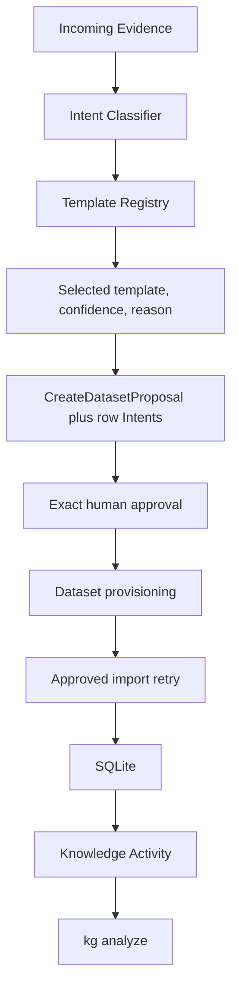

# Dataset Template Guide

Dataset Templates let the SDK recognize structured evidence, explain its choice, and plan the correct local Dataset without asking a user to understand schemas or tables. Templates are read-only planning objects; all canonical writes still use immutable Intents, exact approval, and the existing Engine/Dataset handler path.

## End-to-end workflow



Classification and parsing create no Dataset and write no row. If the Dataset is missing, the proposal contains one `CreateDataset` prerequisite. Every parsed `InsertDatasetRow` depends on it. Dependency-ordered submission provisions first and retries rows only after success. Existing Datasets use the current or additive-upgrade plan.

`kg chat --explain` reports only user-facing planning information:

```json
{
  "template": "blood_tests",
  "template_version": "1.0.0",
  "confidence": 0.98,
  "reason": "recognized a clinical laboratory report",
  "planned_dataset": "Blood Tests",
  "planned_import_count": 74
}
```

The conversational confirmation says which collection will be created or updated and how many observations will be imported. It does not mention schemas, tables, or SQL.

## Template contract

`StructuredDataset::DatasetTemplate` is immutable and contains:

- template ID and semantic version;
- domain and complete `StructuredDataset::Definition`;
- column constraints, indexes, units, and validation rules;
- deterministic selector signals and parser;
- recommended analyzers and analysis semantics;
- default visualizations;
- privacy level;
- review-only recommendation rules;
- declared future adapters;
- trusted plugin owner and a canonical SHA-256 digest.

`StructuredDataset::TemplateRegistry#register_plugin` requires a trusted plugin object exposing `name` and `dataset_templates`. The same ID/version/digest is idempotent; conflicting content is rejected. No template, parser, matcher, validator, or analyzer is loaded from an attached Vault, imported document, Dataset row, email, or model output.

## Built-in catalogue

| Domain | Templates |
|---|---|
| Health | Blood Tests, Medication Schedules, Blood Pressure, Weight, Heart Rate, Sleep, Exercise, Nutrition |
| Finance | Expenses, Income, Subscriptions |
| Trading | Trades, Positions, Equity Curve |
| CRM | Contacts, Meetings, Interactions |
| Generic | Key/Value Measurements, Custom Observation Log |

The generic templates are bounded fallbacks for recognizable columns; ambiguous tables still request clarification rather than guessing.

## Blood tests

The Blood Tests template is normalized. It never creates a physical column for LDL, HDL, hemoglobin, ferritin, or any other biomarker. Each laboratory measurement is a row:

```text
test_date
panel
analyte
value
unit
reference_low
reference_high
reference_text
flag
specimen
laboratory
comments
```

`observed_at` and `marker` are compatibility aliases for approved Phase 13/14 Intents and existing queries. The parser recognizes arbitrary analyte labels in extracted PDF/OCR text or matching tabular headers. It retains the laboratory-supplied reference interval and flag without interpreting either as a diagnosis.

## Evidence and provenance

The complete normalized source rendition is stored locally at `.knowledge/evidence/sources/<source_id>/<content_hash>.json`, so revisions sharing an external source ID remain immutable. `source_uri` points to the original artifact retained by Hermes, an object store, or another adapter. Each imported row stores:

- `evidence_id`;
- `source_uri` and `source_filename`;
- `source_page` and `source_span`;
- `observation_id`;
- `proposal_id` and `approval_id`;
- immutable `intent_id`.

This creates an inspectable chain from the graph Dataset registry note, through a Dataset row, to its exact source evidence. Raw measurements and source content never appear in the Dataset registry Markdown note.

## Analysis and recommendations

The `template-semantics` analysis plugin adapts template-declared time, label, value, and reference fields to the stable `KnowledgeAnalysis` plugin contract. `kg analyze` contains no template-specific dispatch. Installed templates can provide trends and bounded interpretation without changing the analysis engine.

Blood-test reference-range checks may produce a recommendation to review flagged measurements with a qualified clinician. It is a noncanonical `proposal_only` recommendation with no executable Intent. Diagnosis, treatment, medication changes, approval, and execution remain outside this layer.

## Migration and compatibility

Phase 15 is additive:

1. SQLite engine schema version 3 adds nullable row provenance columns and indexes existing `evidence_id` values when present.
2. Existing Dataset identities, rows, schema history, proposals, approvals, receipts, and Activity remain readable.
3. Existing untemplated Dataset notes remain valid. Newly provisioned notes record template ID, version, and digest.
4. Old blood-test Intents using `observed_at` and `marker` are normalized into the new row model. Existing older physical blood-test schemas receive additive optional fields when a new templated observation is approved.
5. Template versions are immutable. A future version that only adds optional columns uses the existing additive lifecycle proposal. Destructive evolution requires a separately approved copy-and-verify migration; template registration cannot weaken that rule.
6. Analysis cache capability version 1.1.0 prevents reuse of pre-template semantic results.

## Performance

- Selection scans the small installed template registry and at most the first 20,000 source characters for specialized matching.
- Header and keyword scoring are deterministic and linear in template count and bounded source size.
- Proposal parsing creates one row Intent per observation; imports remain bounded by the existing one-megabyte capability input and proposal validation.
- SQLite provenance fields are nullable and `evidence_id` is indexed; ordinary queries pay no source-content read cost.
- `kg analyze` retains the existing 10,000-row-per-Dataset cap and reads only template metadata needed for semantics.
