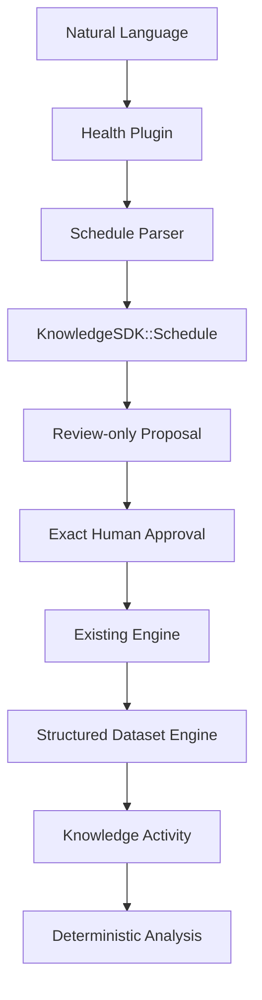

# Health Plugin — Structured Health Templates

Version 15 retains version 14 structured medication recurrence and adds plugin-owned health Dataset
templates while preserving the existing
Proposal, Approval, Engine, Event Bus, Activity, and analysis boundaries.

## Blood Test template

The Health catalogue selects `blood_tests@1.0.0` for clinical laboratory PDFs/OCR renditions and matching CSV/Excel tables. Selection is deterministic and reports confidence plus `recognized a clinical laboratory report`; it does not hardcode analyte names.

```text
test_date, panel, analyte, value, unit,
reference_low, reference_high, reference_text, flag,
specimen, laboratory, comments
```

Each analyte is a row, so LDL, ferritin, Vitamin D, a novel assay, and future laboratory panels use the same model. `observed_at` and `marker` remain compatibility aliases for old approved Intents. Every imported row retains the Evidence ID, original artifact URI and filename, PDF/OCR page/span, observation, proposal, approval, and Intent ID.

`kg analyze` obtains time/value/label/reference semantics from the installed template analysis plugin. It can trend an arbitrary analyte and count rows outside their report-supplied reference interval. A flagged-result recommendation is review-only, contains no executable Intent, and explicitly avoids diagnosis or treatment changes.

## Pipeline



Classification and parsing are read-only. Generated Intents do not execute until their exact IDs
are approved and submitted. Dataset writes are deferred until the existing Engine has passed its
normal candidate validation and commit boundary.

## Generic Schedule object

`KnowledgeSDK::Schedule` is immutable, versioned, and reusable by other plugins. A daily example is:

```json
{
  "version": 1,
  "frequency": "daily",
  "times": [
    {
      "time_of_day": "morning",
      "meal_relation": "before_food",
      "fasting": true
    },
    { "time_of_day": "day" }
  ]
}
```

Supported recurrence shapes are `daily`, `weekly`, `monthly`, `every_n_days`, `cron`, `prn`, and
`custom_interval`. Times may use `morning`, `day`, `evening`, `night`, or a validated `HH:MM` local
time. Weekly and monthly recurrence use `days_of_week` and `days_of_month`; interval recurrence uses
`interval`; cron recurrence uses a five-field `cron` value. `constraints` and `extensions` provide
versioned extensibility without making the object medication-specific. The published contract is
[`schedule.schema.json`](../Structured%20Dataset%20Engine/schedule.schema.json).

## Medication schedule Dataset

```text
schedule_id             TEXT, required, unique immutable business ID
medication              TEXT, required, indexed, not unique
dose                    REAL, optional
unit                    TEXT, optional
route                   TEXT, optional
schedule_json           JSON, required
effective_from          DATE, required, indexed
effective_until         DATE, optional, indexed
active                  BOOLEAN, required, indexed
reason                  TEXT, optional
prescribing_provider    TEXT, optional
notes                   TEXT, optional
created_at / updated_at reserved Dataset audit timestamps
```

`row_id` is the Dataset Engine's logical ULID and is not SQLite's implicit rowid. Public medication
identity uses `schedule_id` (`medschedule_<ULID>`). SQLite rowids are never selected or exposed.
There is no unique constraint on `medication`, so separate morning, day, and evening Berberine rows
are valid. A consumer may also use one Schedule object containing several time slots.

Intervals are inclusive. `effective_until: null` means open-ended. A future course may be inserted
before it starts, and a temporary course has an explicit end. Current and historical membership is
computed from the interval and `active`, not by parsing schedule text.

## Intents and lifecycle behavior

- `CreateMedicationSchedule` appends a new immutable version.
- `ReplaceMedicationSchedule` closes a targeted version and appends its successor. The Phase 13
  `schedule` and `effective_on` parameters remain replay-compatible but are not emitted by new
  proposals.
- `PauseMedicationSchedule` closes an active version and appends an inactive interval version.
- `ResumeMedicationSchedule` closes the paused version and appends an active successor.
- `StopMedication` closes every active interval for the named medication on the approved date.
- `ModifyMedicationDose` closes one version and appends a successor with the approved dose.
- `ModifyMedicationSchedule` closes one version and appends a successor with approved structured
  recurrence.

All are `KnowledgeGraph::DatasetIntent` subclasses. No CLI, parser, or plugin writes SQLite or
Markdown directly.

## Migration strategy

The autonomous registry recognizes only the exact legacy medication shape containing
`effective_on` and `schedule` without `effective_from` and `schedule_json`. It adds an approved
`UpgradeDatasetSchema` prerequisite with `migration_id: medication_schedules_v2`.

Execution performs a single-transaction table rebuild:

1. read legacy logical rows and provenance;
2. rename the legacy physical table and remove its named indexes;
3. create the version 14 table and indexes;
4. convert each legacy schedule and optional `schedule_details` to `KnowledgeSDK::Schedule` JSON;
5. preserve `row_id`, timestamps, provenance, proposal/approval, and Intent IDs;
6. derive a stable `medschedule_<ULID>` from each legacy logical row ID;
7. verify that source and target row counts match;
8. replace the table, record schema history and Dataset activity, and publish `DatasetChanged`.

Any error rolls back the SQLite transaction. A mismatched schema version, unrecognized migration
ID, or non-SDK target schema is rejected. Arbitrary attached-Vault data cannot provide transforms.

## Analysis and explainability

`kg analyze` uses `effective_from`, `effective_until`, `active`, and `schedule_json` directly for
questions such as “What medications was I taking in March?” and “Which medications were active
during my LDL increase?” Medication factors expose the structured recurrence and interval used and
remain explicitly noncausal.

`kg chat --explain` adds safe `parsed_schedule`, `schedule_object`, `effective_interval`, and
`generated_intents` fields. It does not expose handlers, database paths, credentials, matcher
objects, or attached-Vault internals.

## Backward compatibility report

- Existing approved `ReplaceMedicationSchedule(schedule:, effective_on:, schedule_details:)`
  payloads remain constructible and are normalized to the new Schedule object at execution.
- Existing non-medication Dataset schemas, row Intents, Proposal Store records, approvals, Engine
  receipts, events, and Activity projections do not change.
- Missing new medication Datasets are created directly at the version 14 schema after approval.
- Existing legacy medication rows and audit provenance are preserved by the verified migration.
- The removed `unique(medication)` constraint is intentionally relaxed. Callers that assumed one
  row per medication must select by `schedule_id` or effective interval.
- Stored free-text `schedule` and `effective_on` columns are removed only by the approved migration;
  new analysis never depends on them.
